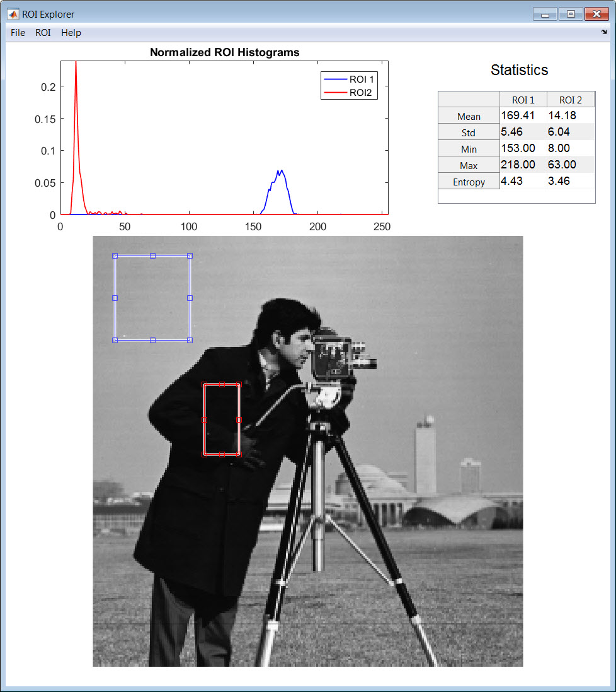

# ROIExplorer
MATLAB application that allows the user to explore the pixel statistics in regions of interest in a grayscale image

# Usage
Just run ROIExplorer.m at the command prompt:

    >> ROIExplorer
